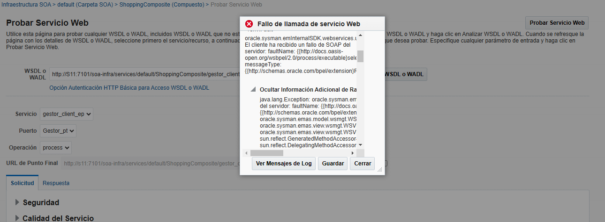

# Práctica 2: "Orquestación de servicios Web utilizando WS-BPEL"
##### Alfonso Jesús Piñera Herrera
## 1. Reserva de vuelos
En este apartado se hablará de la implementación de la parte 1 de la práctica, que consiste en la obtención del mejor precio para un viaje dependiendo de diversos factores.

### Implementación

La implementación de la reserva de vuelos se realiza mediante un proceso BPEL que evalúa las condiciones del viaje y selecciona la mejor opción de precio entre las aerolíneas disponibles. A continuación, se detallan los pasos principales del proceso:

1. **Recepción de la Solicitud:**
    - El proceso BPEL recibe una solicitud de reserva de vuelo con los detalles del empleado, destino y fechas de viaje.

2. **Determinación del Tipo de Empleado:**
    - Se utiliza el proceso `Empleado.bpel` para determinar si el empleado viaja en primera clase o clase turista.

3. **Consulta de Precios:**
    - Se invocan los procesos `Iberia.bpel` y `Vueling.bpel` para obtener los precios de ambas aerolíneas según el tipo de empleado y el aeropuerto de destino.

4. **Comparación de Precios:**
    - El proceso BPEL compara los precios obtenidos de Iberia y Vueling y selecciona el más económico.

5. **Generación del Plan de Viaje:**
    - Se genera un plan de viaje con los detalles de la reserva y el precio final.

6. **Respuesta al Solicitante:**
    - El proceso BPEL envía la respuesta al solicitante con el plan de viaje y el precio seleccionado.

### Diagrama del Proceso

A continuación se muestra un diagrama simplificado del proceso BPEL para la reserva de vuelos:

### Casos de Prueba
- Si viaja con iberia
    - El precio inicial es:
        - Si es turista 10
        - Si es primera clase 25
    - Además, depende del aeropuerto:
        - Si se va a FCO * 15
        - Si se va a AMS * 25
        - Si es otro * 5
- Si viaja con vueling:
    - El precio inicial es:
        - Si es turista 10
        - Si es primera clase 15
    - Además, depende del aeropuerto:
        - Si se va a AMS * 5
        - Si se va a FCO * 10
        - Si es otro * 15
 
1. **Caso de Prueba 1: Reserva para empleado de primera clase**
   - **Descripción:** Verificar que el sistema reserva un vuelo en primera clase para un empleado de alto nivel.
   - **Valores de las variables:**
     - `nombre`: "alfonso"
     - `destino`: "AMS"
     - `fecha_salida`: "2023-12-01T00:00:00"
     - `fecha_regreso`: "2023-12-10T00:00:00"
   - **Resultado esperado:** El sistema debe reservar un vuelo en primera clase y devolver el plan de viaje con vueling 75 €.
   
2. **Caso de Prueba 2: Reserva para empleado de clase turista**
   - **Descripción:** Verificar que el sistema reserva un vuelo en clase turista para un empleado de bajo nivel.
   - **Valores de las variables:**
     - `nombre`: "ana"
     - `destino`: "FCO"
     - `fecha_salida`: "2023-11-15T00:00:00"
     - `fecha_regreso`: "2023-11-20T00:00:00"
   - **Resultado esperado:** El sistema debe reservar un vuelo en clase turista y devolver el plan de viaje con vueling 100 €.
   
3. **Caso de Prueba 3: Fechas de vuelo inválidas**
   - **Descripción:** Verificar que el sistema maneja correctamente fechas de vuelo inválidas.
   - **Valores de las variables:**
     - `nombre`: "luis"
     - `destino`: "GRX"
     - `fecha_salida`: "2023-12-20T00:00:00"
     - `fecha_regreso`: "2023-12-15T00:00:00"
   - **Resultado esperado:** El sistema debe lanzar un error.
   
4. **Caso de Prueba 4: Aeropuerto específico**
   - **Descripción:** Verificar que el sistema ajusta el precio según el aeropuerto de destino.
   - **Valores de las variables:**
     - `nombre`: "maria"
     - `destino`: "GRX"
     - `fecha_salida`: "2023-12-05T00:00:00"
     - `fecha_regreso`: "2023-12-12T00:00:00"
   - **Resultado esperado:** El sistema debe ajustar el precio según el aeropuerto y devolver el plan con iberia a 50 €.
   

### Instrucciones de Despliegue

1. **Preparación del Entorno:**
   - Tener JDeveloper 12c, Oracle SOA Suite y WebLogic Server instalados y configurados.

2. **Despliegue del Compuesto SOA:**
   - Abre JDeveloper y carga el proyecto SOA.
   - Despliega el compuesto SOA en WebLogic Server:
     - Haz clic derecho en el proyecto → Deploy → To Application Server.
     - Sigue las instrucciones del asistente de despliegue para seleccionar el servidor y completar el despliegue.

### Documentación

1. **Descripción del Proyecto:**
   - Este proyecto consiste en un proceso BPEL que gestiona la reserva de vuelos para empleados, seleccionando el precio más barato entre dos aerolíneas (Iberia y Vueling).

2. **Estructura del Proyecto:**
   - **Composite.xml:** Define los servicios, referencias y componentes en el compuesto SOA.
   - **Procesos BPEL:**
     - `Empleado.bpel`: Determina el tipo de empleado (primera clase o turista) en función de la entrada.
     - `Iberia.bpel`: Gestiona la tarificación de vuelos en función del tipo de empleado y aeropuerto.
     - `Vueling.bpel`: Similar a Iberia.bpel con reglas de tarificación ajustadas.
     - `Gestor.bpel`: Se encarga de realizar todo el proceso y comunicarse con los distintos procesos.

   - **Archivos WSDL:** Definiciones de servicios web para cada servicio (Gestor, Empleado, Iberia, Vueling).

3. **Consideraciones:**
El precio varía según una serie de condiciones que he asignado:
- **Clase de Vuelo:**
    - Turista: 10 € (Iberia y Vueling)
    - Primera Clase: 25 € (Iberia), 15 € (Vueling)
- **Aeropuerto de Destino:**
    - **Iberia**:
        - FCO: * 15
        - AMS: * 25
        - Otro: * 5
    - **Vueling**:
        - AMS: * 5
        - FCO: * 10
        - Otro: * 15

#### 2. Regateo de precios entre comprador y vendedor
### Implementación

La implementación del regateo de precios se realiza mediante un proceso BPEL que gestiona la negociación entre el comprador y el vendedor. A continuación, se detallan los pasos principales del proceso:

1. **Recepción de la Solicitud:**
    - El proceso BPEL recibe una solicitud de negociación de precio para un producto específico.

2. **Verificación de Disponibilidad:**
    - Se utiliza el proceso `VerCantidad.bpel` para verificar si el producto está disponible en el inventario.

3. **Propuesta del Vendedor:**
    - El proceso `Vendedor.bpel` ofrece un precio inicial al comprador.

4. **Evaluación del Comprador:**
    - El proceso `Comprador.bpel` evalúa la propuesta del vendedor y decide si acepta el precio o realiza una contraoferta.

5. **Negociación:**
    - El proceso BPEL gestiona la negociación entre el comprador y el vendedor hasta que se llegue a un acuerdo o se termine la negociación.

6. **Confirmación de la Compra:**
    - Una vez que se llega a un acuerdo, se confirma la compra y se actualiza el inventario.

### Diagrama del Proceso

A continuación se muestra un diagrama simplificado del proceso BPEL para la negociación de precios:

##### Casos de Prueba

1. **Caso de Prueba 1: Producto disponible**
   - **Descripción:** Verificar que el sistema maneja correctamente la negociación de precios para un producto disponible.
   - **Valores de las variables:**
     - `producto`: "Camisa"
   - **Resultado esperado:** El sistema debe permitir la negociación de precios hasta que el comprador acepte un precio.
   
2. **Caso de Prueba 2: Producto no disponible**
   - **Descripción:** Verificar que el sistema maneja correctamente la excepción cuando el producto no está disponible.
   - **Valores de las variables:**
     - `producto`: "Smartphone"
   - **Resultado esperado:** El sistema debe lanzar una excepción indicando que el producto no está disponible.
   
##### Instrucciones de Despliegue

1. **Preparación del Entorno:**
   - Tener JDeveloper 12c, Oracle SOA Suite y WebLogic Server instalados y configurados.

2. **Despliegue del Compuesto SOA:**
   - Abre JDeveloper y carga el proyecto SOA.
   - Despliega el compuesto SOA en WebLogic Server:
     - Haz clic derecho en el proyecto → Deploy → To Application Server.
     - Sigue las instrucciones del asistente de despliegue para seleccionar el servidor y completar el despliegue.

##### Documentación

1. **Descripción del Proyecto:**
   - Este proyecto consiste en un proceso BPEL que gestiona la negociación de precios entre un comprador y un vendedor para un producto solicitado.

2. **Estructura del Proyecto:**
   - **Composite.xml:** Define los servicios, referencias y componentes en el compuesto SOA.
   - **Procesos BPEL:**
     - `VerCantidad.bpel`: Verifica la disponibilidad y cantidad de stock del producto.
     - `Comprador.bpel`: Decide si acepta la propuesta del vendedor en base al precio original.
     - `Vendedor.bpel`: Oferta al comprador un precio reducido del original para realizar la venta.
    - `Gestor.bpel:` Lleva todo el proceso de una compra, coordinando entre la verificación de las existencias, la negociación del comprador y las ofertas del vendedor.

   - **Archivos WSDL:** Definiciones de servicios web para cada servicio (VerCantidad, Comprador, Vendedor y Gestor).

